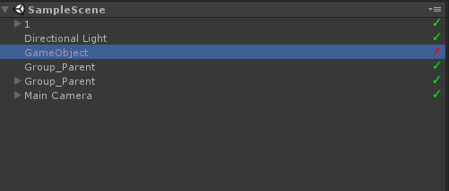
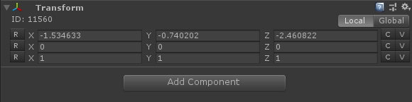
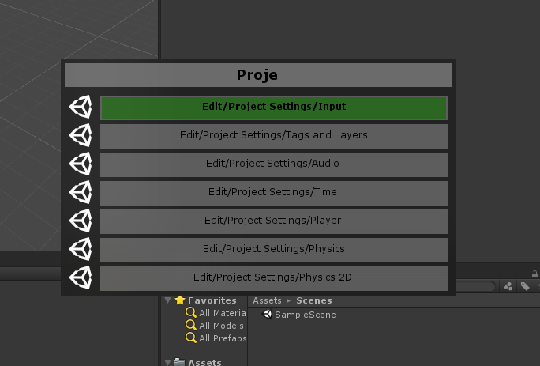

# Unity3D Editor Extensions and Tools

Some basic Unity Extensions: Transform Inspector, Hierarchy Extension, SpotlightWindow (known for MacOS)

## Hierarchy Extension

## Transform Extension

## Spotlight Extension

